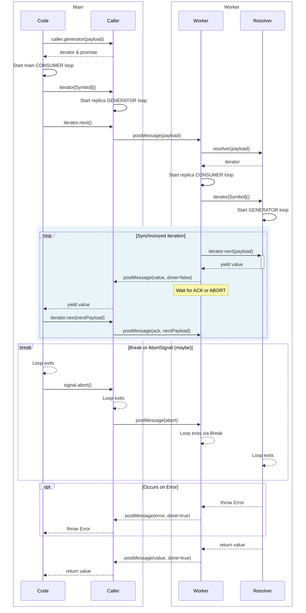

# WRPC

TODO

- [ ] Add to readme https://stackoverflow.com/questions/77727664/how-to-get-returned-value-from-async-generator-when-using-for-await
- [ ] Value passed to next are ignored https://developer.mozilla.org/en-US/docs/Web/JavaScript/Reference/Global_Objects/AsyncGenerator/next#sending_values_to_the_generator

